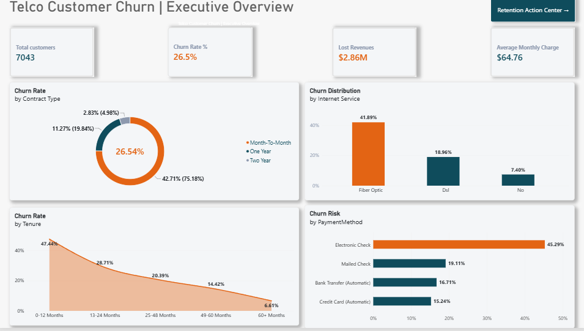
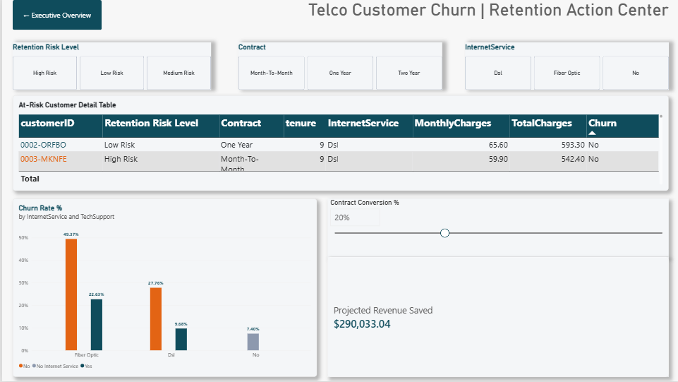

# 📊 IBM Telco Customer Churn & Retention Analytics

## 🎯 Business Problem & Goal

**The Main Question**: Which customers are leaving the company, why are they leaving, and how can leadership stop revenue loss?

### Key Numbers
* **Total Customers Analyzed**: 7,043
* **Overall Churn Rate**: 26.54%
* **Total Revenue Lost**: $2.86M
* **Potential Revenue Saved**: **$290K+** (by convincing 20% of high-risk customers to switch to longer contracts)

---

## 📸 Dashboard Preview

### Page 1: Executive Overview
Shows big-picture metrics like churn rates by contract type, customer tenure, and payment methods.

### Page 2: Retention Action Center
An interactive tool with a searchable list of high-risk customers and a slider to test how much money can be saved by converting contracts.

---

## 💡 Key Takeaways & Recommendations

### 1. Who is Leaving Most?
* **Month-to-Month Contracts**: Customers on month-to-month plans have the highest churn rate at **42.71%**.
* **Fiber Optic + No Tech Support**: Fiber Optic users who don't have tech support leave at an extreme rate of **49.37%**.
* **Electronic Check**: Customers paying by electronic check leave more often than those using any other payment method (**45.29%**).

### 2. When Do They Leave?
* **First-Year Risk**: Nearly half (**47.44%**) of new customers leave in their first 12 months. After 5 years, churn drops to just **6.61%**.
* **Recommendation**: Focus on helping new customers during their first year and bundle tech support with Fiber Optic plans.

### 3. How Much Money Can Be Saved?
* Moving month-to-month users to 1-year or 2-year contracts drastically lowers churn.
* Converting **20%** of these high-risk users saves **$290,033.04** per year.

---

## 🛠️ Tools & Features Used

* **Tool**: Microsoft Power BI Desktop
* **Key Features**:
  * Interactive filters and page navigation buttons.
  * DAX formulas to calculate churn rates and financial projections.
  * Color highlights to easily spot high-risk customers in data tables.
  * An interactive slider for "What-If" scenario planning.

---

## 📁 Repository Structure

* `IBM_Telco_Churn_Dashboard.pbix`: Main Power BI report file.
* `WA_Fn-UseC_-Telco-Customer-Churn.csv`: Raw IBM Telco dataset.
* `page1_executive_overview.png`: Screenshot of Page 1.
* `page2_retention_action_center.png`: Screenshot of Page 2.
